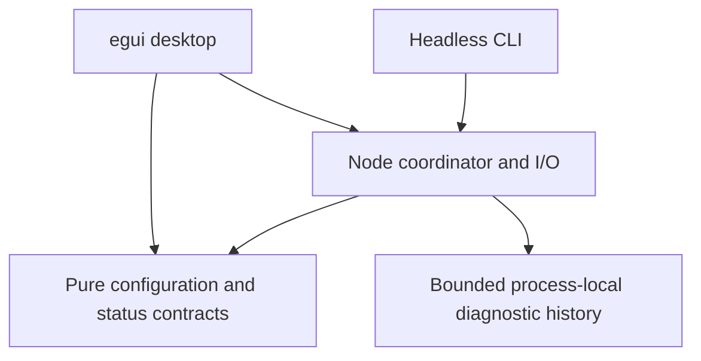

# Architecture

## Current boundaries

`avila-core` has no filesystem, network, clock, or GUI operations. Configuration is
deserialized into an unvalidated type; only validation produces the private-field
`ValidatedConfig`. `avila-node` owns file loading, lifecycle, and events. Both
executables inspect that coordinator. Today it does not spawn workers or run a daemon.

The startup gate remains closed until validation, storage, and networking actually
exist. `NodeSnapshot` deliberately uses optional measurements and identifies its
scope as `local_inspection`. The event journal is bounded process-local diagnostics,
not a consensus transaction log or a backup mechanism.

## Intended component boundaries

| Component | Owns | Must not depend on |
| --- | --- | --- |
| Consensus | Deterministic parsing, validation, state-transition rules | GUI, policy preferences, filesystem or sockets |
| Chain/storage | Blocks, UTXOs, atomic commits, undo, recovery | Desktop state |
| P2P/sync | Peer lifecycle, bounded I/O, scheduling and acquisition | GUI rendering |
| Mempool/policy | Admission, packages, relay policy and explanations | Authority to alter block-validity rules |
| Coordinator | Lifecycle, limits, cancellation, command handling | A graphical session |
| Services/indexes | Explicitly scoped queries, wallet scans and indexing | Implicit access to signing keys or administration |
| CLI/GUI | Commands, snapshots, explanations, interaction | Direct writes to consensus state |

Create these modules/crates when implementing their first complete behavior. Keep
interfaces small enough to extract useful implementations into other node projects.
The architecture specifies responsibilities, not empty success-returning services.

## Data and concurrency

Validation receives explicit chain context and produces typed results. Distinguish
decoding, context-independent checks, contextual acceptance, and local policy.
Cache keys must capture the identity and context of the check, including witness
data and activation/chain state where relevant. Reorgs change contextual conclusions.

Future workers publish immutable snapshots and bounded events to the coordinator.
Commands have identifiers and explicit completion/failure results. The GUI must
not perform validation, blocking I/O, or unbounded event draining during painting.
Coalesce metrics, cap history, make cancellation cooperative, and request repaint
when new data arrives. GUI failure must not become consensus failure.

The remote/daemon control protocol and process-isolation model remain design
decisions. A Rust module boundary alone is not a privilege or process boundary.

## Correctness and trust

Consensus compatibility is a dedicated engineering task. The
[rust-bitcoin project explicitly cautions against treating its library as a full consensus engine](https://github.com/rust-bitcoin/rust-bitcoin#consensus).
Using its types or vetted cryptography would not by itself establish full validation.
Evaluate the validation implementation and reference adapter against pinned
[Bitcoin Core functional tests](https://github.com/bitcoin/bitcoin/tree/master/test/functional)
and independently sourced valid/invalid fixtures.

### Validation-engine decision (recorded for G1)

**Decision: first-party validation.** `avila-consensus` is the validation
engine — implemented from Bitcoin Core's consensus code as the specification,
not by binding to an existing engine. The alternatives were rejected for
distinct reasons:

- `rust-bitcoin` in the validation path: its own documentation cautions
  against consensus use; its `Target::from_compact` already diverges from
  Core on sign-bit-set compact encodings with `size <= 3` (see
  docs/RULE_INVENTORY.md). It remains a dev-dependency — a differential
  *reference*, never validation code.
- `bitcoinkernel` / a Core shared library: cedes the validation boundary to
  C++ internals, contradicts the unsafe-free workspace policy, and makes
  per-rule evidence collection harder. The installed `bitcoind` instead
  serves as the *external* reference through `tools/check_headers_core.py`
  — a process boundary, not a link boundary.

**Trusted dependencies.** The consensus crate's production dependency surface
is `sha2` (hashing) and `thiserror` (error derives). `bitcoin`, `proptest`
and `libfuzzer-sys` are dev/fuzz-only; the `bitcoind` reference daemon and
Python tooling are developer-time verification and never link into the node.

**Extraction boundary.** `avila-consensus` performs no filesystem, network,
clock or GUI operations — every contextual input (time, ancestry, params) is
explicit. Tests, the `check_headers` example and the `fuzz/` workspace sit
outside the library surface, so the engine can be lifted into other node
projects intact; the verification harness would need its fixtures and tools,
which are committed alongside it.

Track the active chain, fully validated history, snapshot assumptions, index coverage
and connection freshness independently. Optional indexes live beside the chainstate —
`txindex.dat`, `cfilters.dat` (BIP158) and `scindex.dat` (scripthash, for the
Electrum server) — each a resumable append log that rewinds with reorgs and
backfills from retained bodies on first enable. The distinction between active and background
chainstates is illustrated by [Core's AssumeUTXO design](https://github.com/bitcoin/bitcoin/blob/master/doc/design/assumeutxo.md).
Avila has not implemented snapshot bootstrapping.

Future network inputs, service permissions, queues, disk use, log payloads and
configuration sizes require explicit limits. Preserve provenance and redaction
boundaries in any diagnostic export. Never treat a majority of implementations
as an automatic rule for resolving a consensus disagreement.

## Dependency and state policy

Pin the toolchain and commit the application lockfile. Keep native GUI features
explicit. The current desktop has no HTTP image loader, remote inspection server,
or telemetry. It embeds the supplied logo in the executable.

The desktop persists only a versioned appearance record (Light/Dark/Black and scale)
using eframe's local application storage. Invalid records fall back to defaults;
scale is finite and bounded. `--theme` overrides the saved choice. Generic egui
memory and native window persistence are disabled, so searches, paths, events and
node state are not included in this record. Future layout persistence needs its
own schema and privacy review. Node configuration remains a separate TOML file.

Review new dependencies for actual purpose, license compatibility, supported Rust
version, feature activation, and effect on the trusted code. Workspace source
forbids unsafe Rust; dependency internals have their own review boundaries.
