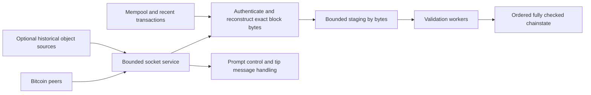

**Avila networking: physical bounds, source audit, and Bitcoin-specific opportunities**

Prepared 2026-09-26. This is a source/configuration audit and analytical model,
not a networking benchmark. No traffic generator, packet capture, live-node
restart, socket tuning, or performance experiment was run. SWE-2 owns execution
under [the networking work order](IBD_NETWORK_WORK_ORDER_2026-09-26.md).

The audit used HEAD `8a8ea5a4e85d337eb937bb48e3147ed7def717bb` plus the working
tree. Other agents are editing this repository. Exact inspected file hashes,
read-only host observations, and arithmetic are recorded in
[the evidence JSON](evidence/2026-09-26-ibd-network-audit.json); line numbers can
move. Static findings below describe those inspected files.

The target remains first launch on an N305-class laptop, empty datadir, through
fully validated usable chainstate. Historical acquisition, helper downloads,
decoding, every applicable consensus check, outstanding script work, and the
completion checkpoint count. A local replay or an assumed snapshot does not
establish that result. The previously quoted 768 decimal GB is an **unverified
working assumption**, to be replaced by the pinned-corpus census.

**1. What Bitcoin gives us that a generic Internet optimizer does not have**

There are three substantial freedoms:

- Historical blocks are public, immutable objects identified by commitments.
  Many sources can serve the same bytes. We can cache, prefetch, resume, and
  distribute them through different transports while checking all Bitcoin
  rules locally. A manifest or a source's reputation is not a substitute for
  those checks.
- The historical serialization repeats information that can be reconstructed:
  script templates, references to earlier transactions, and other structure.
  A lossless representation can transmit fewer bytes without changing the
  Bitcoin block being validated. Its actual compression ratio is unknown.
- At the live tip, a receiver often already has many of the transactions in a
  newly mined block. We can transmit identifiers and missing transactions
  instead of retransmitting everything. This is established Bitcoin protocol
  practice, with a different benefit from cold historical compression.

These freedoms act on **required bytes, available sources, and dependency
round trips**. They do not increase a radio's airtime allocation or an ISP's
provisioned capacity. An implementation can nevertheless move dramatically
closer to those constraints when its own queues currently leave them unused.
The magnitude in Avila still requires measurement.

**2. First distinguish every meaning of a byte and a rate**

The path is approximately:

```
peer storage -> serving/serialization -> sender socket -> TCP/IP
 -> access/transit links -> Wi-Fi/Ethernet receiver -> kernel receive queue
 -> application read -> framing/authentication -> block decoding
 -> staging/validation/state -> fully checked progress
```

A provider's advertised rate, Wi-Fi PHY rate, link traffic, TCP payload rate,
application message rate, unique historical bytes, and fully validated progress
are different measurements. Retransmissions, duplicate block requests, padding,
invalid data, and helper artifacts can consume capacity without advancing the
checked frontier. A compressed byte can conversely reconstruct multiple raw
block bytes. Report both wire cost and useful work.

For a specified representation, define:

```
B = historical representation + required helpers + application overhead
G = sustained delivered application bytes/second at the bottleneck
T_acquire >= B / G
T_complete >= max(T_acquire, required CPU work / CPU capacity,
                 required storage work / storage capacity)
```

The last expression is a lower bound, not a promise that every stage overlaps
perfectly. Networking, decompression, hashing, scripts, and storage share CPU,
memory, cache, and power. Queue fill/drain and dependency barriers add time.
When estimating G from physical link capacity, subtract protocol overhead,
retransmissions, and competing traffic there; do not subtract them twice.

**The one-hour byte budget is particularly useful.** At 1 Gbit/s of actual
application payload, one hour carries 450 GB. The assumed 768 GB requires at
least 41.4% savings before helpers. At a measured 940 Mbit/s payload rate, the
budget is 423 GB and required savings become 44.9%. These are conditions to
meet, not compression estimates.

| Sustained application goodput | Raw 768 GB acquisition | Total application bytes available in one hour |
| --- | ---: | ---: |
| 100 Mbit/s | 17.07 hours | 45 GB |
| 300 Mbit/s | 5.69 hours | 135 GB |
| 500 Mbit/s | 3.41 hours | 225 GB |
| 940 Mbit/s | 108.94 minutes | 423 GB |
| 1 Gbit/s | 102.40 minutes | 450 GB |
| 2.5 Gbit/s | 40.96 minutes | 1,125 GB |

This table uses decimal units, an unchanged corpus, sustained payload rates,
and zero additional helper bytes. It does not identify the user's ISP rate.
Download feasibility and full-validation CPU feasibility must both hold.

**3. The actual link: symbols, packets, windows, and queues**

An application ultimately receives information conveyed by physical symbols.
The modem/radio and link endpoints choose modulation, coding, channel use, and
retry behavior. A Bitcoin-aware application normally cannot change those
negotiated physical capacities. An information-theoretic channel bound would
require actual channel bandwidth, noise, interference, and coding assumptions;
none were measured here. A universal physical minimum for an unspecified
Internet connection would therefore be invented precision.

Even an ideal physical link does not devote every byte-time to block data.
For one explicit example, untagged Ethernet with 1500-byte MTU and IPv4 uses
1538 byte-times per full frame after framing and the inter-frame gap. With
20-byte IP and TCP headers, 1460 bytes carry TCP data: 94.93% efficiency. A
12-byte TCP options allowance gives 1448/1538, or 94.15%. The corresponding
raw-corpus times on a 1 GbE bottleneck are about 108 and 109 minutes. This is
derived arithmetic under those assumptions, not a Wi-Fi prediction.
[RFC 6349, section 4.1.1](https://www.rfc-editor.org/rfc/rfc6349.html#section-4.1.1)
provides the Ethernet accounting.

IPv6, tunnels, VLANs, path MTU, loss, and the provider's rate-accounting layer
change that calculation. ACK traffic uses the reverse path; on a shared radio
or constrained upload it can also affect download performance. Jumbo frames
require path support. Raising only the laptop's MTU does not enlarge an
ordinary Internet path.

The read-only host inspection found one non-loopback interface, an active
`iwlwifi` wireless device with MTU 1500. It did not establish the negotiated
radio rate, interference, router capability, or ISP capacity. A Wi-Fi label
is not delivered goodput: airtime contention, retransmission, aggregation,
power management, and other devices can affect it. SWE-2 should compare the
same workload over the available wireless link and a controlled wired path
if available, without treating either result as universal laptop performance.

TCP also needs enough outstanding data to cover round-trip time. The
bandwidth-delay product is rate times RTT: 1 Gbit/s at 50 ms needs 6.25 MB;
at 100 ms, 12.5 MB; 2.5 Gbit/s at 100 ms needs 31.25 MB. Sender congestion
window, receiver window, and available application data can each constrain
throughput. [TCP's specification](https://www.rfc-editor.org/rfc/rfc9293.html)
defines its ordered byte stream and flow control.

The inspected host already has receive autotuning and window scaling enabled.
`tcp_rmem` is `4096 131072 33554432`; `tcp_wmem` is
`4096 16384 4194304`; the configured congestion control is CUBIC. The 32 MiB
receive limit is not evidence that each live connection actually advertises
that window. Explicit application buffer settings and memory pressure also
matter. [Linux's TCP documentation](https://docs.kernel.org/networking/ip-sysctl.html)
explains the autotuning controls. Inspect actual sockets before changing them.
The laptop's sender congestion-control setting does not choose the algorithm
used by remote peers sending its downloads.

More peers help when individual senders, windows, or paths are limiting. They
cannot multiply the shared last-mile capacity. Eight sources each providing
20 Mbit/s supply only 160 Mbit/s, regardless of the receiver's faster link.
Adding sources beyond saturation can instead increase duplicate data, memory,
CPU, and contention. Preserve peer diversity while identifying sources that
actually possess and serve the required historical range.

For latency, queued bytes often matter more than propagation. An 8 MB queue
behind a 20 Mbit/s upload takes 3.2 seconds to drain. A tiny urgent announcement
cannot overtake bytes already ordered ahead of it on the same TCP stream.
Prioritization must happen before admitting bulk data into that stream. Separate
connections can avoid that stream's ordering dependency, but still share the
router and link queues. Pacing and bounded queues need measurement under
simultaneous upload and download, not only on an idle connection.

**4. What the current Avila source actually does**

These are static findings. Their performance impact has not been measured.
The existing live-path agent has already repaired parts of the throttle and
checked-frontier logic; the findings below account for the inspected revision.

**A. Socket service shares a sequential path with expensive work.** In
[`PeerManager::tick`](../crates/avila-p2p/src/manager.rs), each peer is polled,
then its returned events are dispatched before the next peer is serviced.
Block dispatch invokes `PeerSync::on_block` and chainstate acceptance.
Serving `getdata` also obtains bodies synchronously. `fill_queues` can replay
up to 256 stored blocks before replenishing download requests. The daemon's
outer loop performs flush/audit/background work and sleeps 5 ms per iteration
in [`avila-node/src/sync.rs`](../crates/avila-node/src/sync.rs).

Consequently, nonblocking sockets do not make this a nonblocking application
pipeline. While dispatch or storage occupies that thread, receive queues can
fill, windows can contract, and peers can stop sending. A busy disk can appear
as poor Internet performance. The 5 ms sleep adds a polling-dependent delay;
it is not a fixed five-millisecond penalty on every individual block.

The peer budget named CPU time measures `Instant::elapsed()` around dispatch.
That is elapsed wall time, including any storage wait and scheduling delay,
not measured thread CPU time. Its throttle deliberately skips socket polling
for some peers. Record CPU service and waiting separately before charging
the same legitimate peer both for expensive validation and slow delivery.

**B. Request count and stall timers do not describe byte progress.** In
[`PeerSync`](../crates/avila-p2p/src/sync.rs), the per-peer limit is 16 blocks,
and `stalled()` tests whether the oldest request timestamp exceeds two seconds.
It does not inspect progress on a partially received block. Request timestamps
are created when scheduling, before proof that the request reached the socket.
A 4 MB transfer at 10 Mbit/s alone takes 3.2 seconds; queueing can add more.
This is a static example of a slow but progressing delivery crossing the timer.

The fixed count is not necessarily too small. Sixteen 2 MB blocks mean 32 MB
of application work, already exceeding the 1 Gbit/s, 100 ms BDP. Sixteen
10 KB blocks mean only 160 KB; at an assumed 100 ms replenishment cycle that
supports roughly 1.6 MB/s. The application window must cover transport flight
plus request/serving/refill delays, within a bounded memory budget.

The manager releases aged reservations and can request the blocking frontier
from another peer. Removing a local reservation does not cancel bytes already
queued by a Bitcoin peer. Late originals and duplicates still cost bandwidth.
Count outstanding request copies and estimated bytes, not only unique hashes.

**C. Buffering and accounting obscure the actual cost.**
[`PeerSession`](../crates/avila-p2p/src/session.rs) reads at most 8192 bytes per
successful read call and continues until `WouldBlock`, accumulating decoded
events before returning. It has no explicit per-poll byte/time/event service
budget. A continuously readable peer can occupy the service loop for a long
time. A larger buffer and a bounded polling budget address different costs.

At the one-hour raw-corpus target, 8192-byte reads imply at least 26,042
successful reads per second, or 93.75 million for 768 GB. These are arithmetic
counts, not measured system calls. They are not packet counts: kernel receive
aggregation can combine multiple packets before an application read.

`bytes_sent` is incremented when a frame is queued, before socket writes.
Injected decoys and fixed-cell padding are appended separately. Thus this
counter is not actual transmitted link traffic, and its meaning differs from
`bytes_recv`, which counts successful socket reads. Socket writes themselves
would still not count TCP retransmissions or prove remote receipt. Distinguish
queued bytes, bytes accepted by the socket, TCP delivery, interface traffic,
and unique useful blocks.

**D. The v1 decoder has a concrete coalescing edge case to reproduce.** In
[`FrameDecoder::next_frame`](../crates/avila-p2p/src/codec.rs), `over_buffered()`
rejects a total buffer above 4,000,024 bytes **before** extracting a complete
frame. A legal 4,000,000-byte payload plus its 24-byte header, followed by bytes
of the next legal frame in the same read, exceeds that limit. TCP may coalesce
frames this way. The decoder then returns `PayloadTooLarge` even though no
individual declared frame is too large.

This is a source-derived counterexample; no reproducer was executed here.
Fix and test per-frame limits together with total bounded buffering before
increasing read size. Otherwise larger reads can make the edge case easier
to encounter. The decoder also allocates and reparses a 24-byte header on
each `next_frame` call while a large body is incomplete. A small parser state
can avoid that repeated work while preserving framing and checksum checks.

**E. Compact-block transport names are present, but the protocol is absent.**
[`bip324.rs`](../crates/avila-p2p/src/bip324.rs) recognizes the wire names
`sendcmpct`, `cmpctblock`, `getblocktxn`, and `blocktxn`. However,
[`Message`](../crates/avila-p2p/src/message.rs) has no corresponding variants
or decoders, and the inspected manager has no negotiation/reconstruction
handlers. Its `CompactBlock` inventory tag does not implement the exchange.
[`getpeerinfo`](../crates/avila-node/src/rpc.rs) reports both BIP152 high-bandwidth
flags as hardcoded false. This is a specific missing interoperability feature,
not evidence that a new custom relay protocol is needed first.

**5. Bytes in the machine: when assembly could help**

The receiver's device/driver places data in memory, kernel networking processes
it, the application reads it, transport protection is checked, and the block
is decoded and validated. Each transition can involve cache misses, allocation,
copies, synchronization, and scheduling. The exact DMA, aggregation, and queue
arrangement depends on the device and driver; do not assume Ethernet server
offloads exist on this Wi-Fi device.

Linux offers hardware receive steering where supported and software steering
to distribute receive work. Software steering itself has communication costs.
[The kernel scaling guide](https://docs.kernel.org/networking/scaling.html)
describes these mechanisms. On this laptop, extra networking workers also
compete with script verification for cores, shared cache, and package power.
Measure the combined node, including interrupts and kernel CPU, rather than
maximizing an isolated network-worker graph.

The inspected receive/encode paths contain `Vec` allocation, `VecDeque`
buffering/draining, contiguous-buffer conversion, and intermediate owned
payloads. The v2 path constructs intermediate ciphertext/plaintext buffers.
Count allocations and bytes copied before choosing a lower-level rewrite.
Ownership transfer, reusable storage, incremental parser state, batch reads,
and fewer intermediate representations are candidates for safe Rust changes.

One extra complete copy of 768 GB entails at least 768 GB read plus 768 GB
written through the relevant memory hierarchy. That is 1.536 TB, or 427 MB/s
over an hour. It is not automatically all DRAM traffic: caches and write
allocation affect physical traffic. Several copies may fit available bandwidth
yet still spend CPU and evict validation data. Avoid both assuming copies are
free and declaring them the dominant bottleneck without a profile.

At 213 MB/s, one hypothetical 3 GHz core has only about 14 cycles per raw byte
if it alone handles the entire stream. A measured ten-cycle-per-byte stage
would consume about 71% of such a core. These are budgeting examples, not the
laptop's measured sustained clock or transport cost. Assembly is relevant if
profiles identify a sufficiently large compute-bound routine at this budget.
It cannot fix a request queue that is empty or bytes waiting behind a flush.

The 24-byte v1 message header totals only 24 MB for a million block messages;
removing a few framing bytes cannot explain tens of minutes of a 768 GB sync.
Conversely, checksum/encryption work traverses payload bytes and can matter to
CPU. [BIP324](https://github.com/bitcoin/bips/blob/master/bip-0324.mediawiki)
specifies authenticated encrypted transport. Preserve its checks and account
for configured privacy traffic. Compression belongs before encryption;
compressing the encrypted byte stream does not recover repeated block structure.

**6. Historical acquisition: change the representation and serving system**

The historical corpus need not be acquired exclusively through Bitcoin's
interactive block-request protocol. An optional distribution format can use
HTTP ranges, content-addressed objects, mirrors, a torrent-like scheduler, or
an available LAN source. A Core block-file importer is useful for local work
but is not a first-launch Internet result.

The design question is what the receiver needs to reconstruct, not which
company provides the bytes. A server can package original blocks or a lossless
encoding. The receiver must reconstruct exact consensus-relevant bytes, verify
the header chain and commitments, and perform all consensus checks, including
state/provenance checks. Authentication of an object manifest identifies an
object; it does not prove that its transactions, scripts, or claimed prevouts
are valid. Untrusted providers can withhold, corrupt, or waste time, so retain
bounded validation of inputs, independent discovery, and ordinary P2P fallback.

Node-specific encoding candidates include template-tagged scripts, compact
locators for earlier transaction occurrences, dictionaries, and lossless
encoding of signature syntax. Arbitrary scripts and historical encodings need
an exact escape path. An outpoint locator must reproduce the original txid and
output index with correct occurrence/provenance; it cannot authorize spending
an otherwise invalid or unavailable output.

An example shows why an attractive technique is not yet enough evidence:
replacing a 36-byte outpoint with a hypothetical average five-byte locator
would save 31 bytes per input. At an assumed 1.3 billion inputs that is
40.3 GB, roughly 5.2% of the assumed corpus. The actual count, average locator
size, escapes, and decoding work need the existing census. Even that substantial
result would cover only part of the 345 GB savings needed at 940 Mbit/s.

Do not declare references incompressible merely because their original
serialization contains hashes. A reference can identify bytes already available
elsewhere. Equally, recognizing a script template does not remove its public-key
hash or other essential payload. Neither a universal 25% compression ceiling
nor a 45% achieved saving has been established for this corpus.

Choose independent chunk boundaries to bound memory, permit resume, and let
different sources fill different ranges. Smaller chunks reduce wasted restart
and hedged-download bytes, while larger chunks can improve compression and
reduce metadata/request cost. Dictionary placement and cross-chunk references
can accidentally introduce serial decode dependencies. Count any indexes,
dictionaries, proofs, and advice in both transfer and validation budgets.

Historical serving capacity also has a cost. Serving one thousand fresh nodes
the assumed raw corpus each day requires 768 TB/day, about 71 Gbit/s on average
before overhead. Sharing among peers and edge caches can distribute that load;
it does not erase it. A fast first-node demonstration must identify the serving
infrastructure and cannot establish a sustainable public service by itself.

**7. New blocks: side information, push, repair, and topology**

IBD optimizes sustained completed work. At the tip the relevant metric is
delay to a fully checked usable block, especially its slow tail. Record:

```
first announcement/header -> enough transactions to reconstruct
 -> queue wait -> all applicable checks complete -> published checked tip
```

Also measure when Avila announces/serves that block to others. Earlier header
knowledge and earlier full validation are separate outcomes. Block timestamps
are not precise arrival-time references. Cross-host comparisons require clock
error bounds or instrumentation on a common receiving host.

[BIP152](https://github.com/bitcoin/bips/blob/master/bip-0152.mediawiki) provides
compact blocks, negotiation, six-byte short transaction IDs, prefilled
transactions, and a missing-transaction request/response. The negotiated
high-bandwidth mode can push a compact block without waiting for a separate
request. Reconstruction must handle missing entries and collisions and still
verify the reconstructed block. Support the applicable witness-aware version.

For an illustrative 3,000-transaction block, short IDs occupy about 18 KB.
Header, nonce, counts, coinbase, and other prefilled data add to that. If 150
transactions are missing and average 600 bytes, they add about 90 KB plus
protocol overhead and a recovery exchange. Full coverage instead avoids that
exchange. The raw transactions were obtained earlier; this is not 18 KB of
total lifetime network use for a 2 MB block.

At an assumed 100 Mbit/s payload rate, 2 MB takes 160 ms to serialize and
18 KB takes 1.44 ms, before the additional data above. A recovery round trip
can outweigh those smaller serialization times. Compact-block effectiveness
therefore depends on useful mempool/recent-transaction coverage, peer selection,
prefill policy, and whether new messages wait behind bulk traffic.

Core already implements compact-block relay. Its
[compact-block explanation](https://bitcoincore.org/en/2016/06/07/compact-blocks-faq/)
describes the bandwidth/latency motivation. Completing this support in Avila
is interoperability work. A selling point beyond Core requires a matched
measurement against Core, including missing transactions, CPU load, and
unfavorable cases, not a comparison against Avila's current missing feature.

Transaction prevalidation can move applicable work ahead of block arrival, but
reuse requires an exact cache key and validity context; block-dependent checks
remain. During IBD, unrestricted mempool work can compete with historical
validation. The live-tip policy and historical bulk policy should be evaluated
separately, including the transition between them.

Propagation itself remains bounded by route length. Light in fiber travels
roughly 200 km per millisecond: a 1,000 km fiber path already contributes about
5 ms one way, excluding equipment and queues. Routes are not straight lines.
Useful peers should be evaluated for delivery performance and independence,
not chosen solely by geographic distance or lowest ping.

There is Bitcoin-specific prior art beyond TCP relay. FIBRE uses UDP and forward
error correction to reduce the need to wait for lost-data repair. Its
[current project page](https://bitcoinfibre.org/) and
[deployment guide](https://bitcoinfibre.org/setup-guide/) also emphasize network
topology and the trust/DoS implications of relaying chunks before reconstruction.
That makes it useful architectural evidence, not a drop-in recipe for an
unrestricted consumer peer network.

FEC spends extra bytes so that sufficient received fragments can reconstruct
missing data without a retransmission round trip. A deadline-sensitive new
block and a long bulk download have different tradeoffs. More parity on an
already saturated clean link can make IBD slower. Any experiment needs explicit
congestion behavior, integrity checks, resource limits, and full block
validation; an erasure code is not a consensus proof.

[QUIC](https://www.rfc-editor.org/rfc/rfc9000.html#section-13) can keep unrelated
streams progressing when loss blocks one stream. It still needs the missing
data for a dependent block and shares the physical bottleneck and congestion
budget. Ordinary Bitcoin TCP peers cannot be switched to QUIC unilaterally.
An optional corpus service could use HTTP/3; a custom relay requires support
at both endpoints. Compare packet-processing and cryptographic CPU costs on
this laptop. Neither a new transport nor zero-RTT resumption establishes a
faster first-ever sync by itself.

**8. A concrete architecture to evaluate**

The following is a proposal, not a description of completed implementation:



Keep socket readiness service responsive while expensive block work runs
through bounded queues. This can be a dedicated service thread, an existing
reactor, or another design supported by measurements. Replacing a loop with
an async framework does not itself remove synchronous validation or disk work.
Maintain one clear owner for ordered consensus state and retain the existing
distinction between pending work and the checked frontier.

Use explicit byte budgets for raw buffers, decoded allocations, in-flight
copies, outgoing data, and staged work. Stop admission when downstream capacity
is exhausted; backpressure is necessary at that point. Preserve enough control
service and fairness to avoid a blocked bulk stream disabling peer management.
Prioritize the earliest missing historical dependency while allowing bounded
prefetch that makes validation workers productive.

Adapt request windows to measured throughput, RTT, serving delay, estimated
block size, and current staging room. A progressing large transfer should not
be classified as idle solely by age. Conversely, a peer dribbling bytes must
not reserve unlimited work indefinitely. Separate total deadlines from byte
progress and charge duplicated requests to a clear byte budget.

For live blocks, reserve service capacity before bulk bytes enter ordered send
queues. Negotiate compact relay with suitable independent peers and measure
reconstruction success. Do not spend a core on an exotic transport while an
ordinary compact block still waits behind synchronous chainstate work.

**9. What is established and what remains open**

Established here: explicit transfer arithmetic; current host configuration;
source evidence of coupled socket/validation service, count-based requests,
age-only stall detection, ambiguous byte accounting, the coalesced-frame edge
case, and missing BIP152 handlers.

Not established: the current ISP/peer goodput, percentage of live IBD time
attributable to networking, attainable compression, networking CPU capacity,
an Avila-versus-Core latency win, or first-launch full validation below one
hour. These are the gates in the work order, not reasons to avoid the work.

My engineering judgment is that Avila has concrete opportunities before
assembly or a custom Internet transport. The strongest paths are responsive
bounded I/O, evidence-based request scheduling, standard compact-block relay,
and a measured historical encoding/distribution format. The first three can
recover unused capacity and remove delays; the fourth can change the number
of bytes that must cross the user's connection. CPU/state validation must
still fit the same end-to-end budget.
